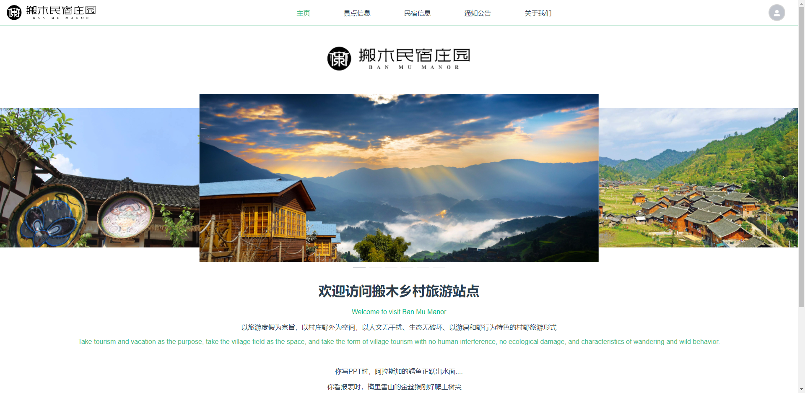
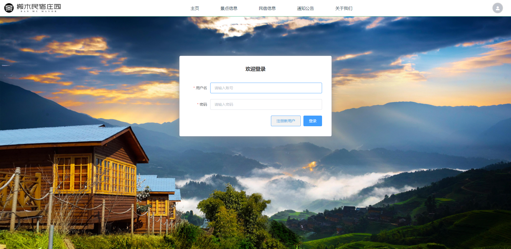
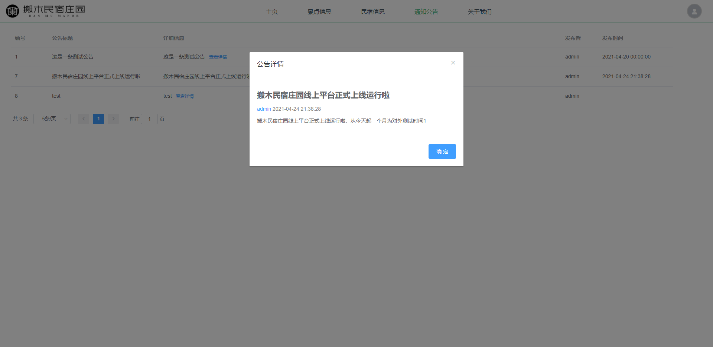
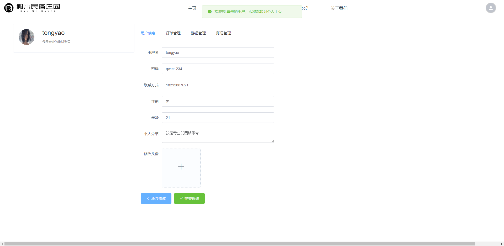
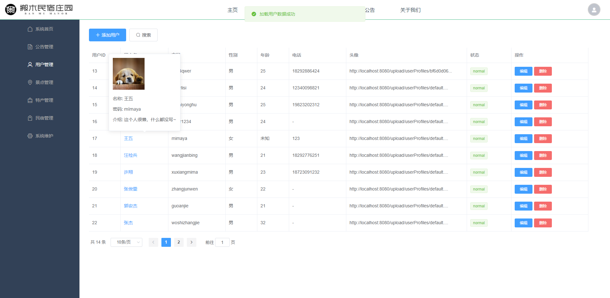
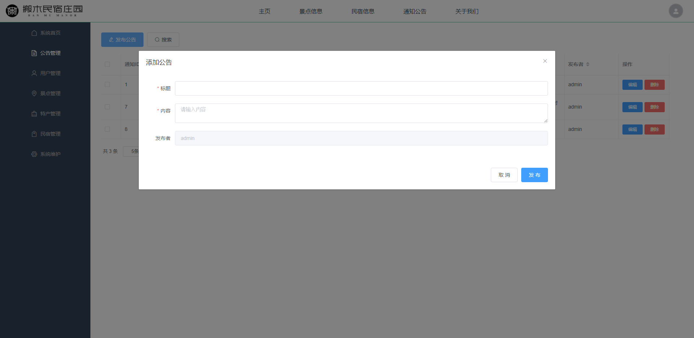
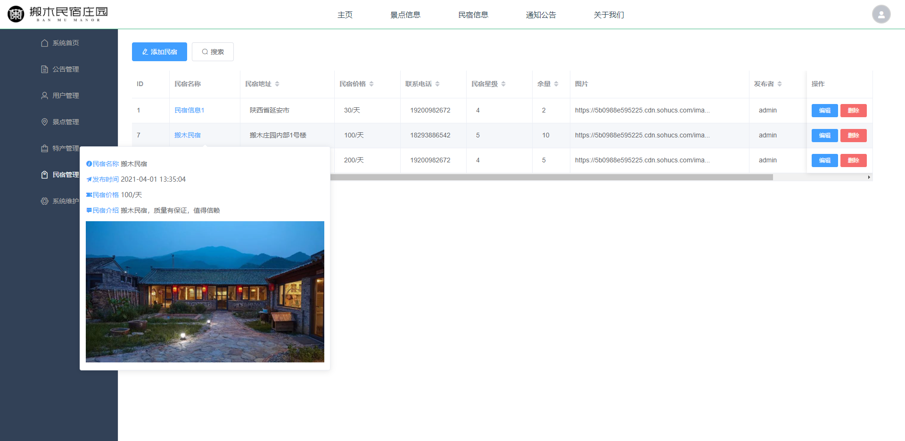

# travel-vue

## 1 Project snapshot

前端主页：



登陆界面



公告栏



普通用户个人主页



后台管理图片1



后台管理图片2



后台管理图片3




## 2 Project setup

注意：确保后端服务器以及MySQL数据库已经启动后再启动本项目，否则前端服务器会占用8080端口（8080是api向后端服务器请求数据的端口）

```
npm install
```

### Compiles and hot-reloads for development
```
npm run serve
```

### Compiles and minifies for production
```
npm run build
```

### Lints and fixes files
```
npm run lint
```

### Customize configuration
See [Configuration Reference](https://cli.vuejs.org/config/).

